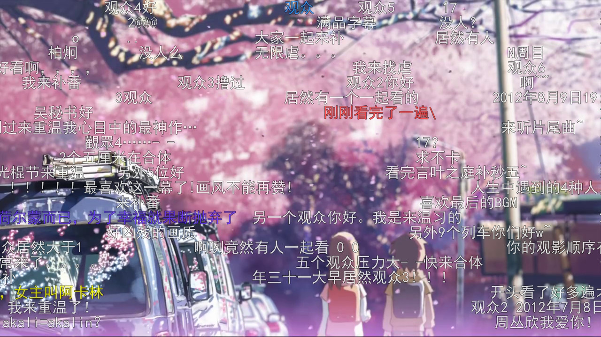

Danmaku2ASS
===========

What is it?
-----------

Danmaku2ASS converts comments from Niconico/Acfun/Bilibili to ASS format so that you can play it with any media player supporting ASS subtitle.

This software is free software released under GPL 3 license. There is no warranty to the extent permitted by law.

How to use it?
--------------

First, you will have to get the XML or JSON file from Niconico/Acfun/Bilibili, many software can help you get it. For example, [you-get](https://github.com/soimort/you-get) and [nicovideo-dl](http://sourceforge.jp/projects/nicovideo-dl/).

Then, execute `danmaku2ass`. You can see further instructions below.

Installing
----------

You may install `danmaku2ass` with the Makefile provided.

```sh
make
make install
```

`PREFIX=` is accepted by `make install` for specifying installation prefix.

A PKGBUILD is also provided.

Example usage
-------------

```sh
./danmaku2ass -o foo.ass -s 1920x1080 -fn "MS PGothic" -fs 48 -a 0.8 -dm 5 -ds 5 foo.xml
```

Name the output file with same basename but different extension (.ass) as the video. Put them into the same directory and most media players will automatically load them. For MPlayer, you will have to specify `-ass` option.

Make sure that the width/height ratio passed to `danmaku2ass` matches the one of your original video, or text deformation may be experienced.

You can also pass multiple XML/JSON files and they will be merged into one ASS file. This is useful when watching danmakus from different website at the same time.

Screenshot
----------



Video: _5 Centimeters Per Second_

Source: http://www.bilibili.tv/video/av135209/

Players for a specific site
---------------------------

If you prefer to watch videos on a specific site listed below with a media player, you can check these projects, which usually provide online streaming features:

- Bilibili: [BiliDan](https://github.com/m13253/BiliDan), (MPV Player, FFmpeg, Linux, OS X, (unstable on) Windows), officially supported by Danmaku2ASS contributer
- Bilibili: [BiliGui](https://github.com/marguerite/BiliGui), (MPV Player, Ruby, Qt4, FFmpeg, Linux)
- Bilibili: [Biligrab](https://github.com/cnbeining/Biligrab), (Aria2, Python2, FFmpeg, OS X, (unstable on) Linux)
- Bilibili: [MoonPlayer](https://github.com/coslyk/moonplayer), (MPlayer, Qt4, Linux, Windows)
- Tudou Doupao, Acfun, Bilibili: [Yatto](https://github.com/Goshin/Yatto), (MPV Player, FFmpeg, Linux)

Please [submit your work](https://github.com/m13253/danmaku2ass/issues) if you have made a better one!

Command line reference
----------------------

```
usage: danmaku2ass.py [-h] [-f FORMAT] [-o OUTPUT] -s WIDTHxHEIGHT [-fn FONT]
                      [-fs SIZE] [-a ALPHA] [-dm SECONDS] [-ds SECONDS]
                      [-fl FILTER] [-p HEIGHT] [-r]
                      FILE [FILE ...]

positional arguments:
  FILE                  Comment file to be processed

optional arguments:
  -h, --help            show this help message and exit
  -f FORMAT, --format FORMAT
                        Format of input file (autodetect|Bilibili|Tudou2|MioMi
                        o|Acfun|Niconico|Tudou) [default: autodetect]
  -o OUTPUT, --output OUTPUT
                        Output file
  -s WIDTHxHEIGHT, --size WIDTHxHEIGHT
                        Stage size in pixels
  -fn FONT, --font FONT
                        Specify font face [default: sans-serif]
  -fs SIZE, --fontsize SIZE
                        Default font size [default: 25]
  -a ALPHA, --alpha ALPHA
                        Text opacity
  -dm SECONDS, --duration-marquee SECONDS
                        Duration of scrolling comment display [default: 5]
  -ds SECONDS, --duration-still SECONDS
                        Duration of still comment display [default: 5]
  -fl FILTER, --filter FILTER
                        Regular expression to filter comments
  -flf FILTER_FILE, --filter-file FILTER_FILE
                        Regular expressions from file (one line one regex) to filter comments
  -p HEIGHT, --protect HEIGHT
                        Reserve blank on the bottom of the stage
  -r, --reduce          Reduce the amount of comments if stage is full
```

FAQ
---

### The text is moving laggy. / The text is slightly blurred.

Most ASS renderers render ASS subtitles at the same resolution as the video. This is probably because the video is at low resolution or framerate.

If you use MPlayer, you can add options similar to `-vf scale=1920:1080` (change the values as you wish).`

### I would like to render the danmakus into the video.

Use `ffmpeg`:

```sh
ffmpeg -i foo.flv -vf ass=foo.ass -vcodec libx264 -acodec copy foo-with-danmaku.flv
```

Change the parameters as you like.

### Danmaku2ASS gave me some warnings of 'Invalid comment'.

This is probably because of comment styles that are not recognized by Danmaku2ASS. This is mostly normal. However, if you think that Danmaku2ASS missed some important things, please feel free to submit an issue.

### Is there a GUI?

Currently no. But there will soon be one made of Gtk+ 3. If you would like to help me, please contact with me.

Contributing
------------

Any contribution is welcome. Any donation is welcome as well.

